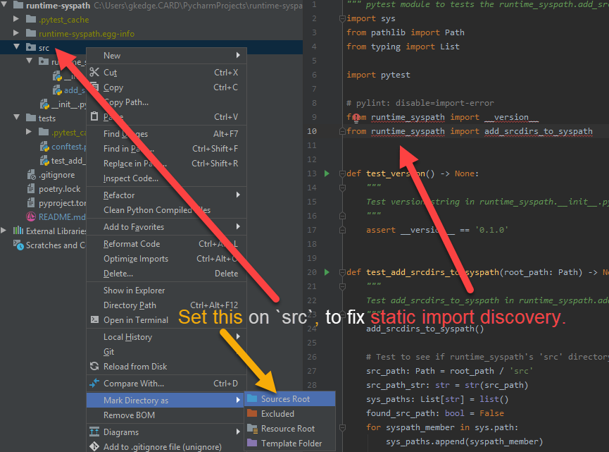

`runtime-syspath` is a package to ease programmatically adding paths to
`sys.path`. This is targeted at python test code that needs to discover
a project's solution source to test.

> :exclamation: It is generally **frowned upon** to alter the `sys.path`
> programmatically as it confuses development, especially refactoring.
> Python IDEs can statically determine if a missing import needs to be
> loaded from PyPi. That static *missing import* detection registers
> false-negatives if the import is discovered via dynamic (programmatic)
> alterations of `sys.path` at runtime.

*The following description assumes the use of `pytest` unit testing
support and a project file structuring that includes project root
directories named `src` (project solution) and `tests` (project tests of
project source under `src`. The `src` directory is-a package (contains
`__init__py`) whereas `tests`, for simple 1-package project testing,
tend to be flat and `pytest`'s
[default test discovery](https://docs.pytest.org/en/latest/goodpractices.html#test-discovery)
negates the need for `tests` being a package (doesn't contain
`__init__.py`):*

```
├─ src
│  └─ __init__.py
|  └─ foo.py
├─ tests
│  └─ test_foo.py
└─ setup.py
```
*That structure is based upon
[this guidance](https://blog.ionelmc.ro/2014/05/25/python-packaging/#the-structure).
See considerations for alternate directory structures below.*

When testing solution source in a project, the test cases can statically
access the solution source by importing with the `src` package prefix:

```
import src.packagename.foo
```
Not only does that not feel right at all, that solution implies that
tests are run **only** from the project root, not within the `tests`
directory itself. If the test is run within the `tests` directory, the
`src` package won't be found at runtime.

So, using:
```
import packagename.foo
```
... the `src` directory would need to be programmatically added to the
`sys.path`. This will allow for tests to be run wherever the test module
is under the `tests` sub-tree. `runtime_syspath` will discover all `src`
directories under `<project root>/src`. The reason that there may be
more is if your project is using `git subprojects` under `<project
root>/src` that have their own `src` directories. Those need to be added
to `sys.path` also.

To leverage `runtime-syspath` to add the `src` directory everytime a
test is run, import and run `add_srcdirs_to_syspath` in
`tests/conftest.py`. (If `tests` contain more `conftest.py` under its
directory tree, the call still only need appear in the root
`test/conftest.py`!):
 ```
 from runtime_syspath import add_srcdirs_to_syspath
 
 add_srcdirs_to_syspath() 
 ```

`add_srcdirs_to_syspath()` will recursively discover **all** `src`
subdirectories under the <project root>. For projects that use `git
submodules`, their `src` directories need to be added to `src.path` for
import access. `git subprojects` could be added to `src` or `tests`
directory trees:

```
├─ src
│  └─ __init__.py
|  └─ projectpackage
│     └─ __init__.py
|     └─ foo.py
|  └─ subproject
|     └─ src
│       └─ __init__.py
|       └─ bar.py
|     └─ tests
├─ tests
│  └─ test_foo.py
|  └─ test_subproject
|     └─ src
│       └─ __init__.py
|       └─ unfoobarrator.py
|     └─ tests
└─ setup.py
```

> :exclamation: Due to the code maintenance and grok'ing mayhem caused
> by indiscriminate runtime additions to `sys.path`, your goal should be
> to limit this anti-pattern to this discovery-of-source being
> tested aspect of import discovery.

> :bulb: Since programmatically adding to a `sys.path` impairs an IDE's
> ability to do static import discovery and leveraging IDE refactoring
> features between the solution source and the test code, an IDE user
> would need to manually mark all `src` directories as such.  
> PyCharm example:
>
> 
